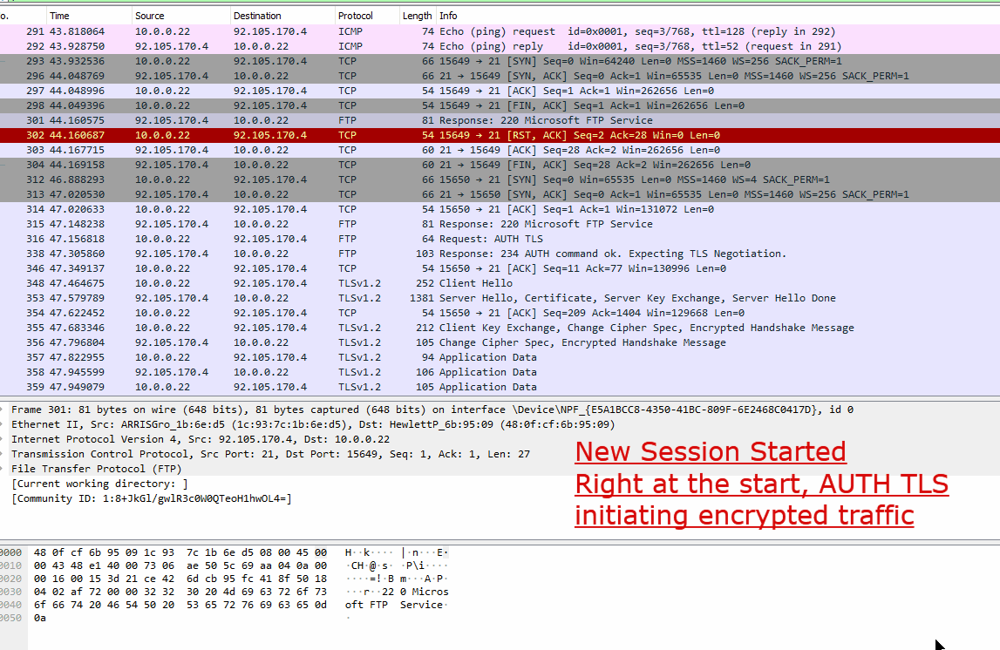

# Notification Email

To Stefan Soller,

I am writing to inform you of some bugs/vulnerabilities in PSPROTECTOR. I was recently working on a project with similar functionalities, and while I was testing your product, came across issues that I qualify as important. Note that I haven't communicated with anyone else (forums, etc). I just wanted to get in touch with the author and bring these to his attention, if he is interested. If not, I will not pursue the matter further and these issues will remain confidential. I'm sending this because if I was the author, I know I would be interested in learning about these issues to fix them.

My name is Guillaume, I'm a video game developper and I live in Quebec. Since you are from Switzerland, I should tell you that I speak french. :)

Here's a resume of the issues I wanted to report:

| **NUMBER of ISSUES** |         **SCOPE**        |                         **SEVERITY**                        |
|:--------------------:|:------------------------:|:-----------------------------------------------------------:|
|           1          |         EVERYONE         | _Critical:the trust that users have. Affecting reputation._ |
|           1          |     AFFECT THE AUTHOR    |        _Medium, can impact your sales if made public_       |
|           1          | EVERYONE USING DEMO MODE |    _Major: Bug capable of disabling parts of the system_    |


If you have any questions, and if you would like to know more about this suject, please feel free to email me and I will gladly explain my findings in details so you 
can improve your product.

Sincerely,


Guillaume

# ISSUES


## Issue 1 - Client Script Code transferred in clear on the internet.

### **SEVERITY** _Critical:the trust that users have. Affecting reputation._
### SCOPE - Affects EVERYONE

### DETAILS

When requesting a new PowerShell Module protection, The Client sends his module code unencrypted over the internet.
This represent a high level of importance / urgency in my opinion since the whole point as to why clients are interested in this product, is to protect their intellectual property, hide their code from other people. If they would learn that their code is being transported in clear outside their network, they would lose trust in the product.

I also think that this is quite an easy fix for you. Given that the communication is using the FTP protocol, getting a basic understanding data exchange is straighforward, and I can deduce the intent. In this case, when the client starts the application, before any transactions, the application will send a PING request while the user is in the Login Screen and immediatly after the command
```AUTH TLS``` is set. This will make all ensuing exchange ***in the same session*** to be encrypted. Up until now, superb. The problem is that the client disconnect from the server after some exchanges and all subsequent re-connections are not followed by another ```AUTH TLS```.

Im sending the session exchanges that happens during a normal transaction. As you can see, there's only traffic encryption in the first session, all subsequent connections are not sending the ```AUTH TLS``` command.

Here there's 2 points:
- ***Why are we disconnecting from the server everytime we do an logic operations on the client ?***
- ***Why aren't we sending AUTH TLS at the start of all new connections.***

#### SOLUTION

I guess just making sure that you always send ```AUTH TLS``` before every client login would fic the issue. Hence why I think it looks simple.
Understanding why there's a disconnection after every operation is optional.


#### DETAILS on SESSION DATA TRANSFER

Example, here's a session recap
   1) PING, receive PONG
   2) Connect to cloud.psprotector.com
   3) AUTH TLS . Receive TLSv1.2 HANDSHAKE
   4) This is where I don't understand. The client receives a FIN packet from the server. So the server request to close the connection.
   5) New connection established
   6) USER
   7) PASS => user login
   8) FEAT => requesting features. Will receive LANG EN; UTF8; AUTH TLS;TLS-C;SSL;TLS-P;...
   9) OPTS UTF8 ON
   10) CWD /
   11) TYPE 1
   12) PASV
   13) STOR //Input/file.xml
   <close connection> 
   14) New connection established, same as 6 - 12
   15) STOR //Input/file.psm1





## Issue 2 - A bug is letting clients bypass the 200 characters limit in DEMO mode.

### **SEVERITY** _Medium, can impact your sales if made public_
### SCOPE - AFFECT THE AUTHOR

Importance: medium. It's not a huge issue but if you want to sell some licences, better fix it. :) I don't know is people are aware of this
in the community. Of course, I have kept this information confidential, like all other bugs I'm telling you about.


### DETAILS

This one I discovered after I made an online installer for my application. Same type as the [Chocolatey Install](https://chocolatey.org/install). I don't think most prople will think of doing this, but once the word gets out, everyone will get on the train...

Basically, I can bypass the demo restriction by doing the following:

User uploads his complete PS1M file to his website as a text file (for mime type). If user doesn't have a website, he can use a public github repo.

Locally, users create a PSM1 file with the following content

```
    iex ((New-Object System.Net.WebClient).DownloadString("<address>"))
```

When the file is loaded by the server, it will download the FULL PSM1 file and process this complete file.


**Example**

1) Try to encode this module file: [TestCrypto.psm1](files/TestCrypto.psm1)
2) Once you receive the Dll, Import the module and witness all the code included in it.


## Issue 3 - A bug is letting clients bypass the 200 characters limit in DEMO mode.

### **SEVERITY** _Major: Bug capable of disabling parts of the system_ 
### SCOPE - EVERYONE USING DEMO MODE

Importance: minimum. It's not a huge issue because of the low probability of it to happen. But if it does happen, the repercussion are quite big. 
Given that the fix is really simple, it was my opinion to raise this issue.

### DETAILS

Obviously, the DEMO account has write access to the //Input and //Output folder. The issue is that it also has the right to DELETE those folders.
When either of those are deleted by the DEMO account, all the other users using the DEMO account will receive an error when attempting a Module conversion.

The Erro is FTP 550 (on upload of files to the folders...) Effectively breaking the service for everyone in DEMO mode.

#### Solution 

Have the folders owned by ROOT/ADMIN. They can be writable by all but cannot be deleted except by the ADMIN...